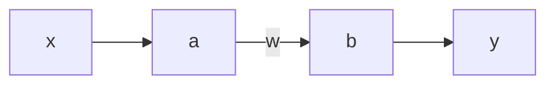
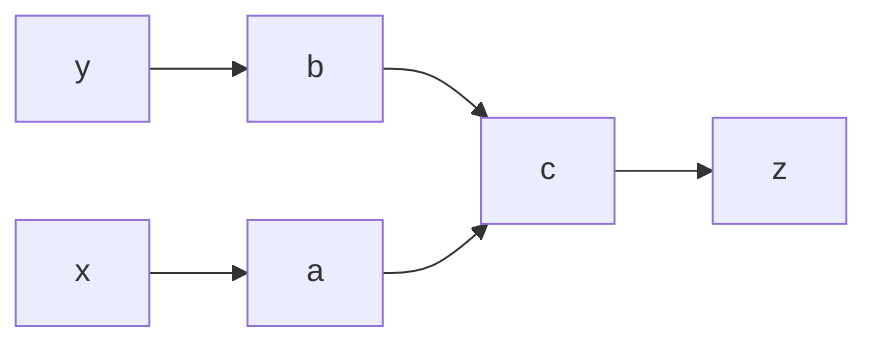

[[Books]] [[Research]] [[Neuromorphic]] 

# Neural Engineering
[[Chris Eliasmith]] 

## The 3 Principles 
- Non-linear encoding + weighted linear decoding
- Transofrmations -> functions of variables represented by the population
- Dynamics -> representations as state variables
- Lots of noise

### System Description
- Interconnectivity
- Response functions
- Tuning curves (activity vs. input)
- Subsystem functional relations
- Overall behavior

### Design Specification
- Explicit operating conditions
- Noise, bandwidth, encoding, neuron number, SNR etc.
- Temporal, dynamic characteristics

### Implementation
- Determine decoding rules, weights
- Determine degree of detail for simulation
- Numerical experiments

## Representation
- Peripheral neuron -> dendritic tree: physical var. -> soma voltages -> spikes
- Decoding weights <-> basis functions for converting back from encoded representation
	- eg. $a_b=\sum a_i2^i$
- $a(x)=G[J(x)]$
	- a -> tuning curve
	- J -> input spikes to soma current (hard)
	- G -> current to spikes (easy)
- $J(x)=J^b+J^d(x)$
	- Bias + driving current

### LIF Model
- $a_i(x):$
	- $\frac{1}{T_i^{ref}-T_i^{RC}ln(1-\frac{J_i^{thresh}}{J_i(x)})}$ if $J_i(x)=\alpha_ix+J^b_i>J_i^{thresh}$
	- $0$ otherwise
- Decoding:
	- Minimize $E = \int_{-1}^1(x-\sum a_i(x)\phi_i)^2dx$
	- Decoders: $\Phi=\Gamma^{-1}\gamma$
		- $\Phi_i=\sum\Gamma_{ij}^{-1}\gamma_j$
	- $\Gamma_{ij}=\langle a_i(x)a_j(x)\rangle_x$
	- $\gamma_j=\langle a_j(x)x\rangle_x$
- Noise:
	- $a_i(x) = a_i(x)+\eta_i$
	- $E = \int_{-1}^1(x-\sum a_i(x)\phi_i)^2dx + \sum\phi_i\phi_j\langle \eta_i\eta_j\rangle + \sigma^2\sum\phi_i^2$
	- Decoders: $\Phi=\Gamma^{-1}\gamma$
		- $\Phi_i=\sum\Gamma_{ij}^{-1}\gamma_j$
	- $\Gamma_{ij}=\langle a_i(x)a_j(x)\rangle_x + \sigma^2\delta_{ij}$
	- $\gamma_j=\langle a_j(x)x\rangle_x$

> Neurons typically transmit ~3bits/spike -> 10% error (SNR=10)
> Error ~ 1/N (noise error)
> Error ~ 1/N^2 (static distribution error, first term)

### LIF for vectors
- $J_i(\bar{x})=\alpha_i\langle \phi_i,\bar{x}\rangle_n+J_i^b$
	- $\phi_i$: preferred direction vector
- Decoding:
	- $\hat{x}=\sum a_i(\bar{x})\phi_i$
- Eg. Arm Movements
- Typically $\phi_i = \tilde{\phi_i}$: preferred direction decoding canot extract magnitude info
- Rhesus: $a_i(\theta)=b_0+b_icos(\theta_i-\theta_o)$: cosine tuning curve
- Optimal decoding: Min. $E(\hat{x})$
	- $\hat{x}=\sum(a_i(\hat{x})+\eta_i)\phi_i$

### Infinite Dimensional Spaces
- Functions($\infty$): $G_i[\alpha_i\langle \tilde{\phi_i}(\nu)x(\nu)\rangle_{\nu}+J_i^b]$, $\sum a_ix(\nu)\phi_i(\nu)$
- Vector Fields($\infty \times N$): $G_i[\alpha_i\langle \tilde{\phi_i}(\nu,[n])x(\nu,[n])\rangle_{\nu}+J_i^b]$, $\sum a_ix(\nu,[n])\phi_i(\nu,[n])$

### Functional Representation
- If sensitive to location of stimulus alone -> $\nu=[\nu_1 \nu_2 \nu_3]$
- But, different stimuli can occur at same location -> $x(\nu;A)=f_A(\nu)$
	- $f_A(\nu)$ varies based on type/shape of stimulus
	- $A$ -> parameter to range over function space
- $x(\nu)$: Domain: $\nu \in [\nu_{min},\nu_{max}]$
- $x(\nu,A)=\sum A_m\Phi_m(\nu)$,  $A \in \rho(A)$, $m=1,2,..M$
	- $\rho$ -> pdf of $A$, diffuclt to determine, estimated through MC sampling
- We only want to represent some A's
- If $\rho(a)$ is such that only one A is likely:
	- $a_i(x(\nu,A))=a_i(A)=G[J_i(A)]$
	- $J_i(A)=\alpha_i\langle \tilde{\phi_i}(\nu)x(\nu,A)\rangle_{\nu}+J_i^b$ -> does not involve underlying basis 
- Tuning curve depends on probing method
- Need to know how to map $\nu$ --- $\phi$ --> $J$ to get the experimental tuning curve
- Tuning curve resembling encoding function depends on stimulus being close to the 'delta function of the neuron'

### Representing A
- Choosing a set of $A_I$'s -> defines function ensemble that neural system can support
- Soma current only sensitive to A -> representing $A$ instead of $x(\nu,A)$
- Decoders: $\tilde{\phi_i(\nu)}=\sum\tilde{q}_{im}\Phi_m(\nu)$
- Encoder: $a_i(A) = G_i[\alpha_i\langle \bar{A}\bar{q}_i\rangle_m+J_i^b]$
- Function representation <-> vector problem

### LIF Spiking Neuron
- $J_M=C\dot{V}+\frac{V}{R}$
- $\dot{V}=-\frac{1}{\tau_{RC}}(V-J_MR)$
- Advantages:
	- Incorporates physical parameters
	- Good approximation
	- Introduces spike
- Disadvantages:
	- Point-like, no extent
	- Ion conductances not modeled
	- Dendrites neglected

### Rate Codes vs. Timing Codes
- Rapidly changing signals (few ms)
- Rate code limitations (amplitude frequency ambiguity)
- Time signature is relevant (same rate, different structure)
- Mean rate code contradicts synaptic connection redundancy
- Rate codes don't have enough bandwidth
- But:
	- Instantaneous rate  is important in timing codes (averaged)
	- Timing relative to stimulus onset is important 
- Finally:
	- Instantaneous rate codes < Rate/timing (?)
	- Brain uses different codes for different purposes
	- No need to choose a code, it is determined by the model

## Spike Decoding 
- LIF: $a(x(t))=G[J(x(t))]=\sum\delta(t-t_n)$
- Central neurons estimate $y(x(t))$ instead of $x(t)$ sometimes; have to deal with encodings of previous layers
	- Need to estimate the correct decoder
- Neuron's decoder decodes all the previous stages of encoding -> can be thought of as having decoder for a neuron

## Opponent Pairs
- Push-pull amps analogy
- Neurons occur in pairs to encode opposing stimuli (up/down, left/right)
- Low stimulus -> low firing rate -> long time to determine stimulus
- Opponency fixes this; has a roughly constant mean firing rate

### Linear Decoder
- $\hat{x}(t)=\int_0^Th(t-t')\sum\delta(t'-t_n)dt'$
	- $=\sum h(t-t_n)$

### Gaussian Windowed Estimation
- Averaging over trials <-> one long trial with spaced windows
- $W(t-t_{\alpha})=e^{-(t-t_{\alpha})/2\Delta t^2}$
- $E=\frac{1}{T^2}\int_0^T\int_0^T[W(t-t_{\alpha})*\Delta S(t;A)]^2dtdt_{\alpha}$
	- Limits ideally $2\Delta t$, $T-2\Delta t$ but Gaussian so it's fine
- $\Delta S(t;A)=S(t;A)-h(t)*R(t;A)$
	- $S$ -> rasmples, randomly generated
- After some Fourier transforms:
- $E=\int\int|W(\omega-\omega')|^2|\Delta S(\omega;A)|^2d\omega d\omega'$
- Differentiating and setting to zero:
- $h(\omega)=\frac{\langle A(\omega)R^*(\omega)\rangle_A}{\langle|R(\omega;A)|^2\rangle_A}$
	- Optimal linear decoder does not depend on nature of encoding

>Spike encoding introduces spurious power at high frequencies
>Decoder needs to LPF
>$h(t)$ resembles a PSC waveform
>Filter derived from fast-varying ensemble works well for slow and fast signals

## Information Transmission
- Info=$\frac{1}{2}log_2(1+SNR)$: Gaussian model
- SNR: Signal variance / unexplained variance(RMSE)
- $Info(\omega_n)=\frac{1}{2}log_2[\frac{\langle |A(\omega_n)|^2\rangle_A}{\langle |A(\omega_n)|^2\rangle_A-\frac{\langle |A(\omega_n)R^*(\omega_n;A)\rangle_A|^2}{\langle |R(\omega_n,A)|^2\rangle_A}}]$
- Rate$(R_I)=\frac{\delta\omega}{4\pi}\sum Info(\omega_n)$

## Adaptive LIF
- $\dot{V}=1\frac{1}{\tau_RC}(V(1+\frac{R}{R_{adapt}})-J_MR)$
- $\dot{R}_{adapt}=\frac{R_{adapt}}{\tau_{adapt}}$
- Biophysically more accurate
- Removal of strong non-linearity near threshold
- Adaptation linearizes response function
- But, more computationally intensive

## $\Theta$ Neuron
- To model 'Class I' neurons: most populous in mammals
- Similar to HH model + voltage dependent K-current ($J_A$)
- No exlicit delta-generator; inbuilt ($R_K,R_{Na}$)
- Saddle node bifurcation
- Location of state vector along spike trajectory through single phase variable $\theta$
- $\dot{\theta}=(1-cos\theta)+(1+cos\theta)(\beta+\sigma)$
	- $\beta$ -> bias
	- $\sigma$ -> input
- 100x more computationally intensive than LIF
- Spike shape not modeled
- ![[Pasted image 20210709152942.png]]

## Wilson Neuron
- Simplified HH model
- $\tau_m=0$, $h=1-n$
- Parameters: R, H, V

> PSCs can be used instead of optimal decoder with little loss in performance

## Population-Temporal Representation
- Representing time-varying vectors
- Temporal code -> adds distortion to population code
- Post-synaptic activity: $\alpha_i(x,t)=\sum h_i(t-\Delta_i(x(t))+t_{io})$
	- $t_{io}$ -> RV $\in [0,\Delta_i(x(t))]$
	- Needs to be constant for a constant signal, but isn't -> fluctuation error
- New source of error in representation
- $E_{total}=E_{static}+E_{noise}+E_{fluctuations}$
- $E_{total}=E_{static}+E_{noise}+\sigma_{\hat{x}(t)}^2$
	- Last two terms can be clubbed into one error term
	- Leads to 1/N behavior

## Transformations
- Network:

- $a_i(x)=G_i[\alpha_i\tilde{\phi}_ix+J_i^b]$
- $\hat{x}=\sum a_i(x)\phi_i^x$: superscript denotes which variable the decoder is for
	- Similarly for y
- For the identity transform: $y=\hat{x}$
	- $b_j(x)=G_j[\alpha_j\hat{\phi}_j\sum a_i(x)\phi^x_i+J_i^b]$
	- $b_j(x)=G_j[\sum w_{ji}a_i(x)+J_i^b]$
	- $w_{ji}=\alpha_j\hat{\phi_j}\phi_i^x$
- Instantaneous firing rate of neuron $b_j$ is result of LIF response to $J_j(x)$, which is determined by dendritic current $w_{ji}a_i(x)$
- Can analytically determine weights; learning ca be incorporated

### Addition
- Network:

- 